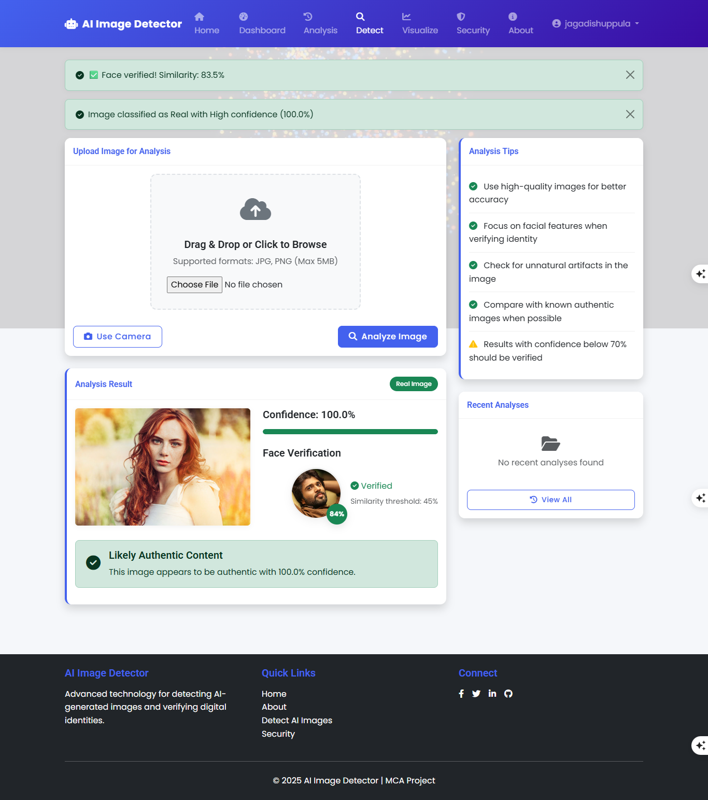

# Detecting AI-Generated Images Using Facial Similarity and Feature Extraction for Digital Security

A Django-based web application for detecting AI-generated images and facial verification using deep learning models.


## 🚀 Features

- **AI Image Detection** - Detect AI-generated images using Xception model
- **Facial Verification** - Verify identities using FaceNet
- **Real-time Camera Capture** - Capture images directly from camera
- **User Authentication** - Secure login and registration system
- **Security Dashboard** - Comprehensive analytics and history

## 🖼️ Application Gallery

| Feature | Screenshot |
|---------|------------|
| **Homepage** |  |
| **AI Detection** |  |
| **Face Verification** |  |
| **Anlysis Page** |  |
| **Visualize** |  |


## 🛠️ Technologies Used

### Frontend
- **HTML5, CSS3, JavaScript**
- **Bootstrap 5** - Responsive design
- **Chart.js** - Data visualization

### Backend
- **Django 4.2** - Web framework
- **Python 3.11** - Programming language
- **SQLite** - Database

### AI/ML
- **TensorFlow** - Machine learning framework
- **OpenCV** - Computer vision
- **Xception** - AI image detection model
- **FaceNet** - Facial recognition
- **MTCNN** - Face detection

## 📦 Installation

### Prerequisites
- Python 3.8+
- pip (Python package manager)
- Git

### Step-by-Step Installation

1. **Clone the repository**
   ```bash
   git clone https://github.com/jagadish-uppula/ai-image-detector.git
   cd ai-image-detector
   ```

2. **Create virtual environment**
   ```bash
   python -m venv venv
   source venv/bin/activate  # On Windows: venv\Scripts\activate
   ```

3. **Install dependencies**
   ```bash
   pip install -r requirements.txt
   ```

4. **Run migrations**
   ```bash
   python manage.py migrate
   ```

5. **Create superuser (optional)**
   ```bash
   python manage.py createsuperuser
   ```

6. **Run development server**
   ```bash
   python manage.py runserver
   ```

7. **Access the application**
   Open http://localhost:8000 in your browser

## 🎯 Usage

1. **Register/Login** - Create an account or login
2. **Upload Image** - Use the upload feature or camera capture
3. **AI Detection** - Get instant analysis of AI-generated content
4. **Face Verification** - Verify identities through facial recognition
5. **View Results** - Check detailed analysis in your dashboard

## 📁 Project Structure

```
ai-image-detector/
├── screenshots/          # Project screenshots
├── detector/            # Main application
│   ├── models.py       # Database models
│   ├── views.py        # Application logic
│   ├── urls.py         # URL routing
│   └── ai_models/      # AI model files
├── accounts/           # User authentication
├── static/            # CSS, JS, images
│   ├── css/
│   ├── js/
│   └── images/
├── templates/          # HTML templates
│   ├── base.html
│   ├── home.html
│   └── about.html
├── media/             # User uploaded files
├── requirements.txt   # Python dependencies
└── README.md         # Project documentation
```

## 🔧 Configuration

### Environment Variables
Create a `.env` file for configuration:
```python
DEBUG=True
SECRET_KEY=your-secret-key
ALLOWED_HOSTS=localhost,127.0.0.1
```

### AI Models
- Place pre-trained models in `detector/ai_models/`
- Ensure models are compatible with TensorFlow 2.13+

## 🤝 Contributing

We welcome contributions! Please follow these steps:

1. Fork the repository
2. Create a feature branch (`git checkout -b feature/AmazingFeature`)
3. Commit your changes (`git commit -m 'Add some AmazingFeature'`)
4. Push to the branch (`git push origin feature/AmazingFeature`)
5. Open a Pull Request

## 👥 Authors

- **Uppula Jagadish** - [My GitHub](https://github.com/jagadish-uppula)

## 🙏 Acknowledgments

- Django community for excellent documentation
- TensorFlow team for ML capabilities
- Bootstrap team for UI components

---

<div align="center">

**⭐ Don't forget to star this repository if you find it helpful!**

</div>
